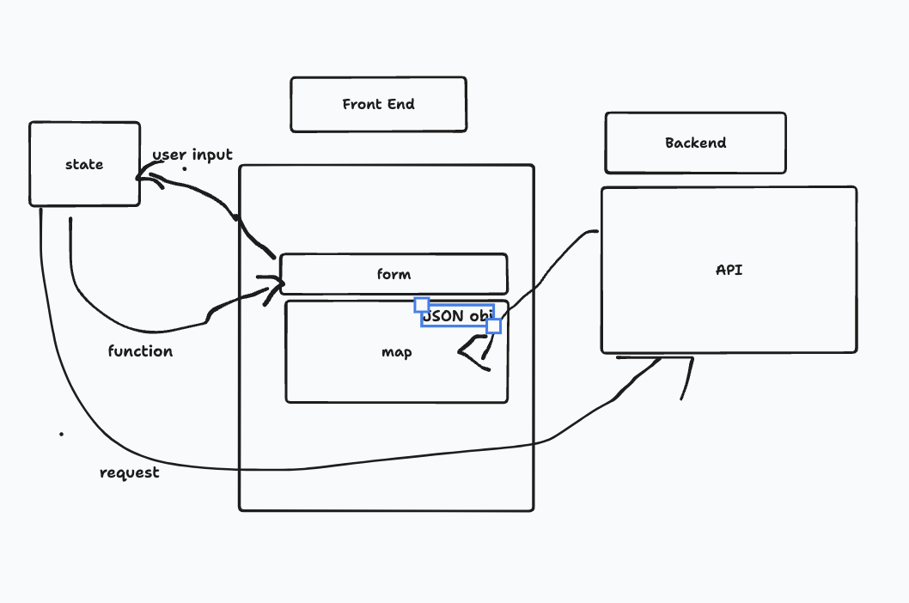
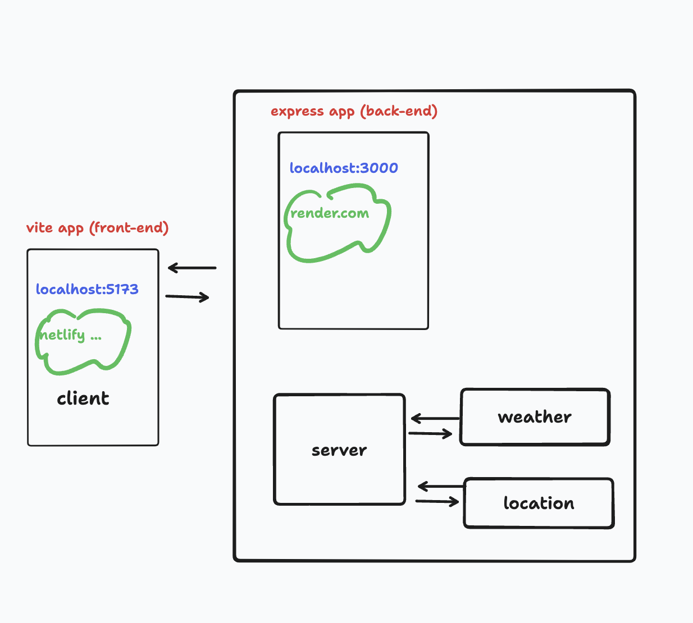
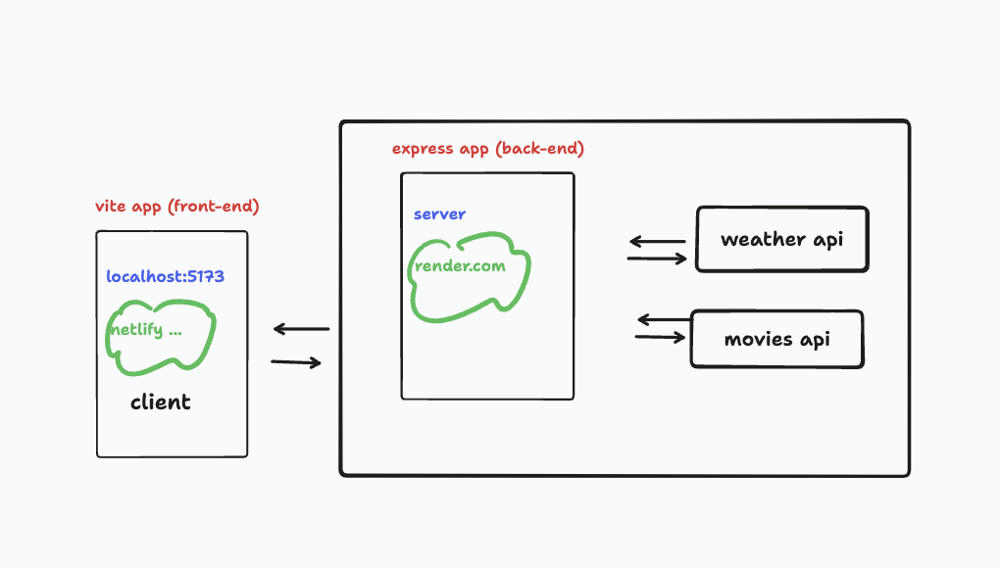
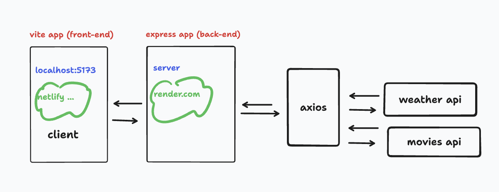
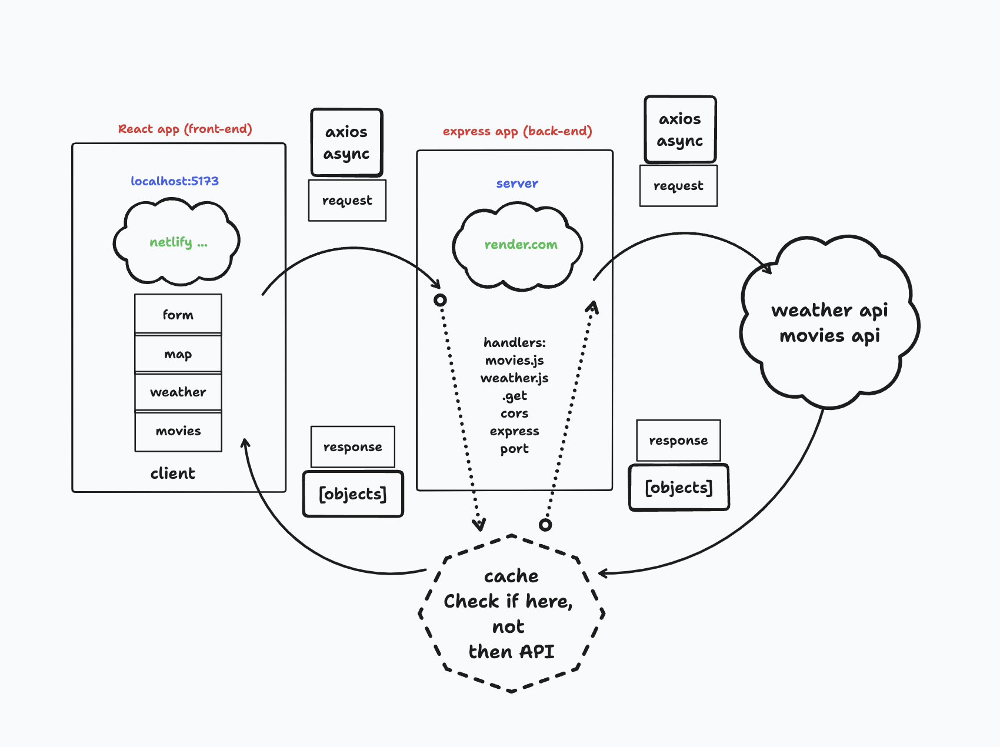
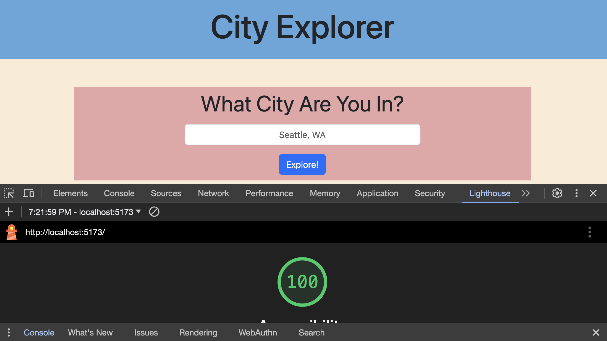
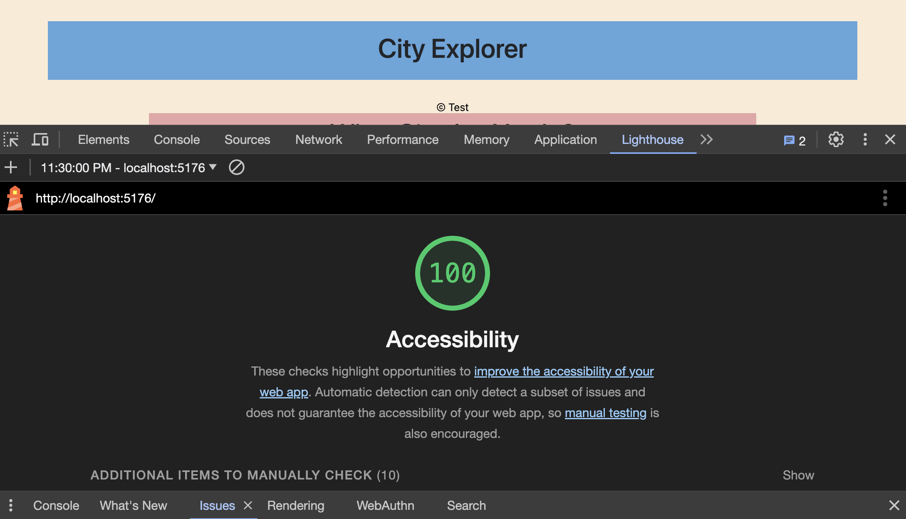
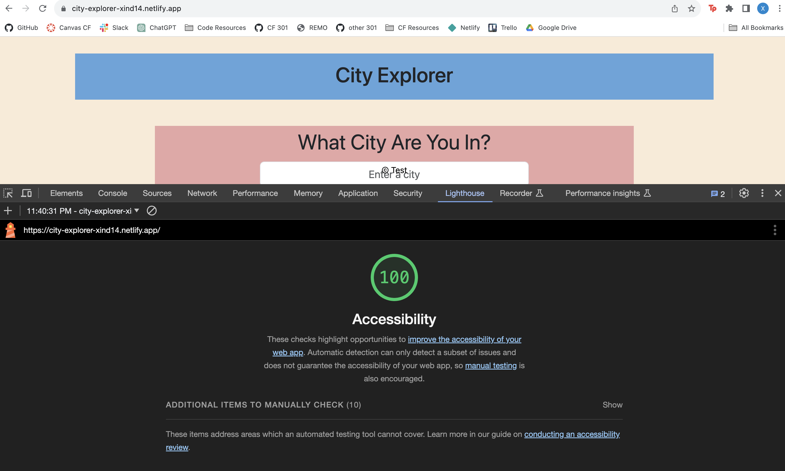

# City Explorer Lab 06-10

## Labs
**Author**: Xin Deng

### Lab 06
**Version**: 1.0.0 (increment the patch/fix version number if you make more commits past your first submission)

### Lab 07

**Version**: 1.0.1 (increment the patch/fix version number if you make more commits past your first submission)

### Lab 08

**Version**: 1.0.2 (increment the patch/fix version number if you make more commits past your first submission)

### Lab 09

**Version**: 1.0.3 (increment the patch/fix version number if you make more commits past your first submission)

### Lab 10

**Version**: 1.0.4 (increment the patch/fix version number if you make more commits past your first submission)

## Overview
<!-- Provide a high level overview of what this application is and why you are building it, beyond the fact that it's an assignment for this class. (i.e. What's your problem domain?) -->

City Explorer application utilizes the Axios library to render user's request for location data (such as the longitude and latitude and a map) from LocationIQ (third-party API) and rendering a respective seven day forecast along with movies related to that city. 

1. Lab 06: Building a City Finder that displays a map of the city the user types in.
2. Lab 07: Adding forecast to be displayed
3. Lab 08: Add movies and forecast to be displayed with an API
4. Lab 09: Refactor code by componentizing front and backend
5. Lab 10: Build a cache to avoid unnecessary API calls 

## Getting Started
<!-- What are the steps that a user must take in order to build this app on their own machine and get it running? -->

Monday: Chris Acosta

Tuesday: Brendan, Steph

Wednesday: Self

Thursday: Self

Friday: Self

### React App

1. Create a new React App with Vite `npm create vite@latest front-end`
1. Perform initial installation and add any dependencies
   - `npm install`
   - `npm install axios bootstrap react-bootstrap react-if` 
1. Create a repository (front-end) at GitHub
1. Connect your React App to GitHub
   - git init
   - git branch -M main
   - git remote add origin (url to your repo, copied from gitHub)
   - git add .
   - git commit -m "initial commit"
   - git push origin main
1. Clear out all of the starter-code from the app and alter `App.jsx` to just render an `<h1>` with Hello World in it 
1. Deploy your app to Netlify
1. Verify that you can see the started app deployed at Netlify

### Express App

1. Create a new repository (back-end) at GitHub
   - Add a README
   - Choose the MIT license
   - Choose the "Node" .gitignore template
   - Make it "public"
   - Copy the URL
1. Clone this on your computer in a different folder from your react app
1. Create a file called server.js (`touch server.js`)
1. Initialize an NPM module 
   - `npm init -y`
   - Install the basic dependencies for an express app
   - `npm install express cors dotenv axios`
1. Write a basic express server (use the above notes and demo as the basis)
1. Store the `PORT` in a file called `.env`
1. Deploy this to Render.com
1. Verify that you can see data coming from the `/` route once deployed

### Getting them to work together

1. Change your Express server's `/` route to return a JSON object. Something simple like:
   `{ message: "Hello" }`
1. Push to gitHub so that it deploys to render.com
1. Add a button to your React app that, when clicked, will do an async axios call to your server's `/` route
   - This will require that you put the URL to your server in the `.env.local` file and use that in the app to make the Axios call
   - We do this for security!
   - (This is shown in the demo)
1. When the data comes back, put it into state, and render that `message` in the `<h1 />`
1. Push to github so that it will deploy to netlify.com

At this point, you should be able to click a button and see the data from your server flowing to the front-end.

## Architecture
<!-- Provide a detailed description of the application design. What technologies (languages, libraries, etc) you're using, and any other relevant design information. -->
REACT, JavaScript, Bootstrap, CSS, APIs, Axios and are used.

## Change Log
<!-- Use this area to document the iterative changes made to your application as each feature is successfully implemented. Use time stamps. Here's an example:

01-01-2001 4:59pm - Application now has a fully-functional express server, with a GET route for the location resource. -->

### Lab 06

- 12-04-2023 3:00pm - Application now has structures and files needed to start
- 12-04-2023 5:20pm - Application now has a form that can enter a city and get back lat and lon
- 12-04-2023 6:50pm - Application now has a rendered map of that city
- 12-04-2023 7:20pm - Application now has an alert if something goes wrong 

### Lab 07

- 12-05-2023 11:32pm - Application now has backend getting right data
- 12-06-2023 06:30am - Application now has forecast rendered from API

### Lab 08

- 12-07-2023 11:32pm - Application now has live forecast and movies rendered from API

### Lab 09

- 12-08-2023 04:30am - Application now has server side refactored

### Lab 10

- 12-09-2023 04:30pm - Application now has live forecast and movies rendered from API inside cache.

## Credit and Collaborations
<!-- Give credit (and a link) to other people or resources that helped you build this application. -->

[Johns In Class Demo Lab 06](https://github.com/codefellows/seattle-code-301d110/tree/main/class-06/demo/city-explorer)

[Johns In Class Demo Lab 07](https://github.com/codefellows/seattle-code-301d110/tree/main/class-07/demo)

[Johns In Class Demo Lab 08](https://github.com/codefellows/seattle-code-301d110/tree/main/class-08/demo)

[Johns In Class Demo Lab 10](https://github.com/codefellows/seattle-code-301d110/tree/main/class-10/demo)

[React Emojis for Forecast](https://dreamyguy.github.io/react-emojis/)

ChatGPT/Tammy, John, Brandon

## Time Estimates

### Lab 06

1. Number and name of feature: Feature #1: Set up your React repository & API keys.
    - Estimate of time needed to complete: 1 hrs
    - Start time: 2:20pm
    - Finish time: 3:00pm
    - Actual time needed to complete: 40 min

1. Number and name of feature: Feature #2: As a user of City Explorer, I want to enter the name of a location so that I can see the exact latitude and longitude of that location.
    - Estimate of time needed to complete: 2 hrs
    - Start time: 3:00pm
    - Finish time: 5:20pm
    - Actual time needed to complete: 2 hr 20 min

1. Number and name of feature: Feature 3: As a user, I want to see a map of the city so that I can see the layout of the area I want to explore.
    - Estimate of time needed to complete: 2 hrs
    - Start time: 5:20pm
    - Finish time: 6:50pm
    - Actual time needed to complete: 2 hrs

1. Number and name of feature: Feature 3: As a user, I want clear messages if something goes wrong so I know if I need to make any changes or try again in a different manner.
    - Estimate of time needed to complete: 1 hr
    - Start time: 6:50pm
    - Finish time: 7:20pm
    - Actual time needed to complete: 30 min

### Lab 07

1. Number and name of feature: Feature #2: Weather (placeholder): As a user of City Explorer, I want to see weather info for the city I searched, so that I know how to pack for an upcoming trip.longitude of that location.
    - Estimate of time needed to complete: 3 hrs
    - Start time: 2:30pm
    - Finish time: 11:32pm
    - Actual time needed to complete: 8 hrs and still not done

### Lab 08

1. Number and name of feature: Feature #1: Weather (live): As a user of City Explorer, I want to see weather info for the city I searched, so that I know how to pack for an upcoming trip.
    - Estimate of time needed to complete: 3 hrs
    - Start time: 2:30pm
    - Finish time: 7:00pm
    - Actual time needed to complete: 5 hr 30 min

1. Number and name of feature: Feature #2: Movies: As a user of City Explorer, I want to see info about movies related to the city I searched, so that I can learn more about the destination. how to pack for an upcoming trip.longitude of that location.
    - Estimate of time needed to complete: 3 hrs
    - Start time: 7:00pm
    - Finish time: NA
    - Actual time needed to complete: 9 hrs and still not done

1. Number and name of feature: Feature #3:Publish: Deploy your server. As a user, I want to access the City Explorer application on the web, so that anyone can explore from anywhere.
    - Estimate of time needed to complete: 3 hrs
    - Start time: NA
    - Finish time: NA
    - Actual time needed to complete: NA

### Lab 09

1. Number and name of feature: Feature #1: Refactor: Modularize the back-end codebase.
    - Estimate of time needed to complete: 3 hrs
    - Start time: 4:30pm
    - Finish time: 8:00pm
    - Actual time needed to complete: 4 hr 30 min

1. Number and name of feature: Feature #2: Refactor: Componentize the front-end codebase.
    - Estimate of time needed to complete: 3 hrs
    - Start time: 10:00pm
    - Finish time: NA
    - Actual time needed to complete: 8 hrs and still not done

### Lab 10

1. Number and name of feature: Feature #1: Performance: As a user, I want the application to work with recent results, so that I can see info without the app doing unnecessary API calls.
    - Estimate of time needed to complete: 3 hrs
    - Start time: 3:00pm
    - Finish time: 7:00pm
    - Actual time needed to complete: 4 hrs

## Lighthouse Accessibility Report Score

## Reflections and Comments

### Lab 06 

1. A link to the deployed version of your latest code.
1. A link to your public Trello board.
1. A question within the context of this lab assignment.
    - My map rendered in the preview and in the live server and now it isn't working I don't get it. I'm really frustrated. I'm taking a loss on this lab. I'm tired....
1. An observation about the lab assignment, or related ‘Ah-hah!’ moment.
    - There has to be a better way to debug, why am I being shown that things are working when they dont. CSS is still so confusing. 
1. How long you spent working on this assignment.
    - Almost six hours 

### Lab 07

1. A link to the deployed version of your latest code.
1. A link to your public Trello board.
1. A question within the context of this lab assignment.
    - I still not sure how to debug backend and front end at the same time. Localhost, api is still so confusing
1. An observation about the lab assignment, or related ‘Ah-hah!’ moment.
    - When Tammy help me figure out what to get from the nested data.
1. How long you spent working on this assignment.
    - Almost 10 hrs and still not done.

### Lab 08

1. A link to the deployed version of your latest code.
1. A link to your public Trello board.
1. A question within the context of this lab assignment.
    - I don't understand how to get localhost working to debug. I'm collecting server errors like pokemon cards like what "hundreds" number am I going to get next...
1. An observation about the lab assignment, or related ‘Ah-hah!’ moment.
    - I had an ah-hah moment when Brandon showed me how to get local host to work but then I forgot... I thought it was a plug and chug lab since we already written the weather function yesterday, but wow it's so complicated. 
1. How long you spent working on this assignment.
    - 9 hours and I'm still not done. I stayed up till 6:30am to finish lab07 and I have a feeling I will tonight as well. 

### Lab 09

1. A link to the deployed version of your latest code.
1. A link to your public Trello board.
1. A question within the context of this lab assignment.
    - How can I remember what changes in one file and where the effects the changes can connect to  and make those changes when refactoring? is it better to start at the last child and work up to app? Like city form affects weather, movies, and map do i just start with one of those three? I find that when I do that sometimes certain words get changed and then i get lost on where else to change those.  
1. An observation about the lab assignment, or related ‘Ah-hah!’ moment.
    - Sometimes I feel like I get where things connect or calls to where and then I confuse myself because I'm not sure if I don't actually get it or I'm overthinking it. But an ah-hah moment was when I spent some time today finishing lab 8 and I found server side to be a lot easier to refactor.
1. How long you spent working on this assignment.
    - 7 hours and I'm still not done. 

### Lab 10

1. A link to the deployed version of your latest code.
1. A link to your public Trello board.
1. A question within the context of this lab assignment.
    - How much exactly can we store api calls in cache before render.com or any server sites go 'no.'? Also, I get API keys protect others from accessing your project, but what's the security against API's themselves? In a way wouldn't they be able to collect data on user input because they receive the requests? 
1. An observation about the lab assignment, or related ‘Ah-hah!’ moment.
    - It really helped to say what the starter code was saying into words so I could break apart mine to see where they could fit.
1. How long you spent working on this assignment.
    - 3 hrs

  <!-- 
  local host issue fixes
  lsof -i :3000 = error address already in use
  kill -9 <PID>
  npx kill-port 3000 -->

